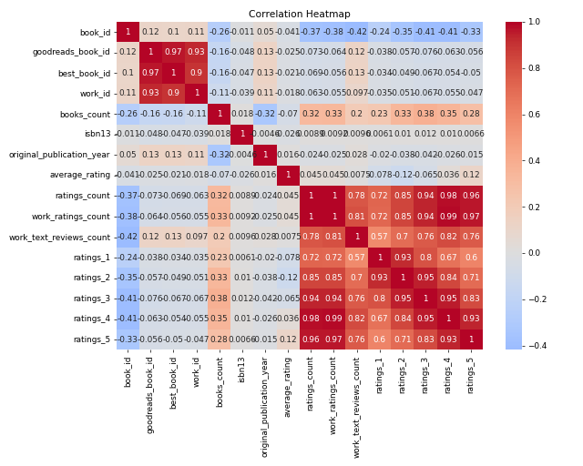
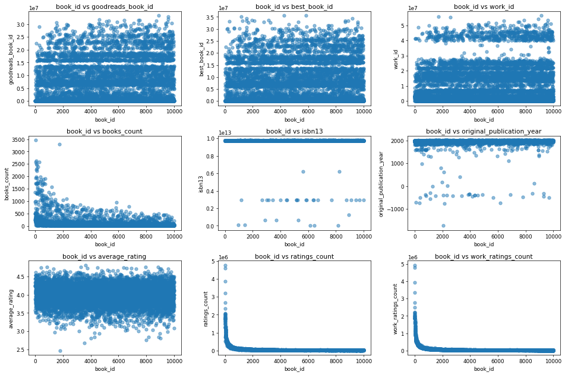

The dataset paints a rich tapestry of insights into the world of books, capturing details about 10,000 titles along with their ratings, authors, and publication histories. With a keen focus on numeric columns such as average ratings, ratings counts, and publication years, I delved into their structures, uncovering relationships and trends that highlight the dynamics of book popularity and reader perceptions.

In our exploration, we identified three distinct clusters within the dataset. These clusters can represent categories of books, such as bestsellers, critically acclaimed, and niche favorites, based on parameters like average ratings, number of ratings, and the number of reviews received. For instance, high average ratings coupled with significant ratings counts indicate popular titles that resonate widely with readers, whereas lower engagement might characterize more specialized genres.

Key insights emerged during the analysis. Firstly, the average rating distribution revealed a slight majority clustering between 3.5 and 4.5, suggesting that while many books perform well, a substantial number hover just below the highest accolades. The identification of outliers also proved fascinating; for example, numerous books received perplexingly high or low ratings, hinting at polarized opinions which could stem from cultural or contextual factors. The prevalence of missing data, particularly in fields like `isbn` and `language_code`, raises questions about the completeness of the dataset and emphasizes the need for careful data curation.

These insights potentially influence marketing and publishing decisions. For publishers, understanding which books fall into high-performing clusters can inform marketing strategies, book launches, and recommendations. Library curators might leverage this analysis to steer acquisitions towards titles that are highly rated or show significant reader engagement. Moreover, the presence of outliers may guide authors and marketers in adjusting their narratives or identifying unique selling propositions that appeal to divergent audience segments.

Further, the analysis suggests that potential relationships exist between the number of reviews and the average rating. It seems that books with a higher number of ratings tend to cluster around higher average ratings, illustrating the network effect of social proof in the literary realm. This phenomenon signals to authors and content creators the importance of cultivating reader feedback early in the release cycle.

In conclusion, this dataset unlocks a treasure of insights into reader preferences and can steer future publishing strategies. The identified clusters signify the market segments that could be targeted for tailored marketing campaigns, while the analysis of outliers and rating phenomena highlights existing patterns and preferences, all of which empower stakeholders to cultivate a more audience-centric approach in the world of books.

## Visualizations

