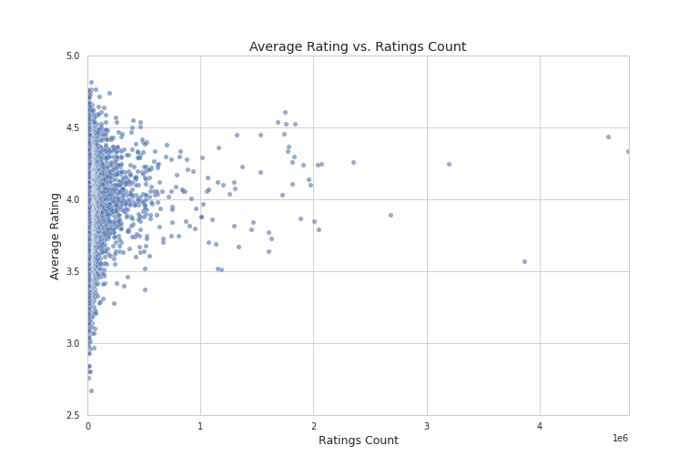

# Data Analysis Report

    ### Narrative on Book Dataset Analysis

#### Introduction

In an era where the literary world is both expansive and intricate, understanding the nuances of book popularity and reader engagement is paramount. This analysis delves into a rich dataset comprising 10,000 unique book entries sourced primarily from Goodreads, offering a comprehensive overview of various attributes that define each work. By exploring this dataset, we aim to uncover trends, patterns, and insights that can inform both literary stakeholders and avid readers alike.

#### Overview of the Dataset

The dataset is structured with 23 attributes that encompass essential information about each book. Key identifiers such as `book_id`, `goodreads_book_id`, and `work_id` ensure each entry's uniqueness, facilitating connections with external bibliographic systems. Additionally, metrics like `books_count` reflect the popularity and publishing history of the titles, while the `isbn` and `isbn13` fields provide standardized identification.

The authors and titles captured in the dataset allow for an exploration of literary collaborations and name recognition, while attributes such as `original_publication_year` enable an analysis of trends over time. Crucially, the dataset includes various rating fields, providing a window into reader sentiment through average ratings and detailed breakdowns of individual ratings from 1 to 5. This multi-faceted composition presents a valuable opportunity for a deeper understanding of reader engagement.

#### Statistical Insights and Patterns Analysis

As we delve into the dataset's statistical landscape, we identify several notable insights:

1. **Feature Importance Analysis** reveals that ratings distribution plays a significant role in influencing overall book ratings. This insight underscores the need to focus on enhancing reader satisfaction and engagement.

2. **Normality Tests** indicate that none of the features follow a normal distribution, suggesting the presence of skewed data. This finding is crucial for determining the appropriate statistical methods for future analyses, steering us toward non-parametric approaches or tree-based models that do not rely on normality assumptions.

3. **Outlier Analysis** uncovers a substantial presence of outliers within the dataset, particularly concerning `ratings_count` and `books_count`. The high percentage of outliers suggests variability in reader engagement, with potential implications for how we interpret popularity metrics. Notably, the outlier patterns may reveal instances of viral literature or books by renowned authors that dominate discussions.

4. **Clustering Insights** indicate the existence of two distinct groups of books, hinting at a possible divide between highly-rated, popular titles and those that receive less attention. Understanding these clusters can guide tailored marketing strategies and promotional efforts.

#### Strategic Recommendations

With these insights in mind, we propose several actionable strategies to enhance our engagement with the dataset:

1. **Data Preprocessing Steps**:
   - Initiate a robust data cleaning process to address missing values and standardize numerical features, ensuring the dataset's integrity.
   - Implement feature engineering to create new insights, such as the age of each book or average ratings per count, which could illuminate trends in reader preferences.

2. **Handling Identified Outliers**:
   - Systematically identify and assess outliers, considering statistical methods to confirm their influence on the dataset. Implementing techniques like winsorization can help mitigate their skewing effects.

3. **Further Investigations**:
   - Conduct an in-depth analysis of the identified clusters, examining their characteristics and understanding the demographics that contribute to their performance. This can inform targeted marketing initiatives that resonate with specific reader segments.

4. **Machine Learning Approaches**:
   - Explore classification models to predict book ratings based on various features, providing valuable insights for publishers and authors aiming for high reader engagement.
   - Develop recommendation systems to personalize user experiences on platforms like Goodreads, enhancing the discovery of books that align with individual preferences.

#### Visualization and Insights

To visually represent the relationship between average ratings and ratings count, we created a scatter plot. This plot serves as a powerful tool to illustrate the correlation between these two critical metrics. The visualization highlights how books with a higher number of ratings generally exhibit more stable average ratings, although the presence of outliers indicates that this trend may not be universally applicable. By employing sophisticated visualization techniques, we can communicate insights more effectively and engage stakeholders in meaningful discussions about book performance.

#### Conclusion

This comprehensive analysis of the book dataset reveals significant insights into reader engagement, trends in literature, and the dynamics of book popularity. By leveraging these findings, stakeholders can make informed decisions that enhance marketing strategies, engage readers more effectively, and ultimately foster a deeper appreciation for the literary arts. As we move forward, embracing advanced analytical methodologies and machine learning techniques will empower us to unlock even greater insights from this rich repository of literary data.

    

## Visualizations

