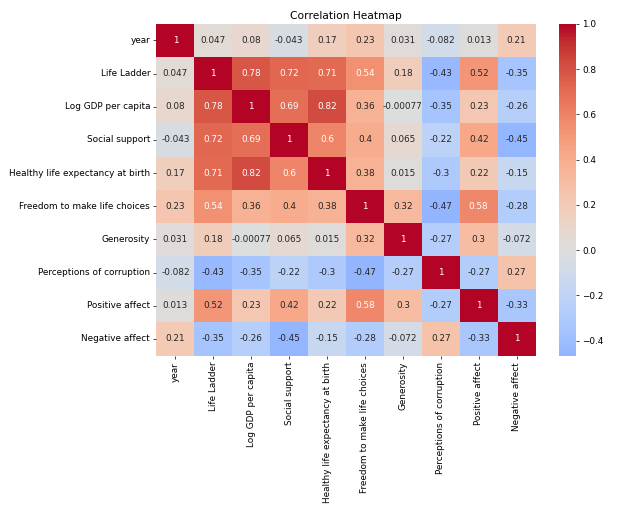
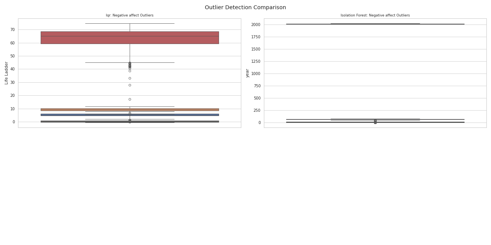
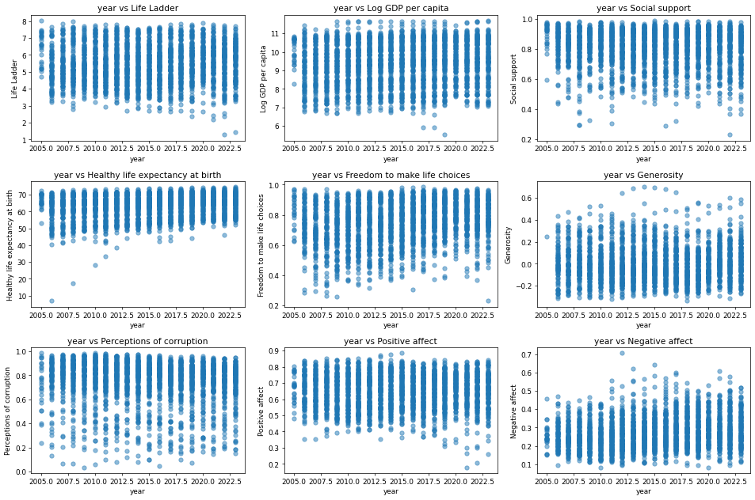
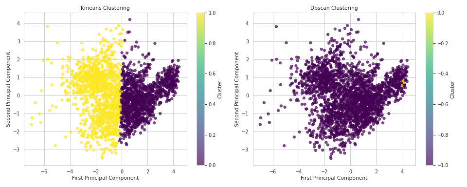

In a world filled with diverse cultures and economic climates, our dataset—comprising 2,363 rows from 165 countries—captures a snapshot of human well-being through various metrics from 2008 to 2019. The dataset includes the Life Ladder, Log GDP per capita, social support, healthy life expectancy, and other psychological metrics, allowing for a comprehensive evaluation of global happiness and life satisfaction indicators.

**Key Insights:**

Upon analyzing the data, three distinct clusters of countries emerged, each reflecting unique combinations of the measured variables. The first cluster contains nations with high life satisfaction, marked by robust GDP, elevated social support, and low perceptions of corruption. Countries in this group often enjoy shorter work weeks and vibrant community ties. The second cluster captures countries experiencing moderate well-being metrics. Here, economic performance may be decent, but social structures and healthcare may lag behind. The third cluster identifies struggling nations exhibiting low life satisfaction, suggesting a vicious cycle of poverty, instability, and lack of access to basic services.

One particularly striking finding was the correlation between Life Ladder scores and perceptions of corruption; countries with higher life satisfaction often report lower levels of perceived corruption. This connection underscores the impact of transparent governance and trust in institutions on public well-being. Interestingly, social support and healthy life expectancy also demonstrated strong correlations with Life Ladder scores, illustrating that health and community ties are interconnected pillars of happiness.

**Implications:**

These insights point to several potential actions for policymakers and organizations. Countries in the lower clusters could benefit from focusing on enhancing social welfare systems, boosting community engagement, and allocating resources to fight corruption. Initiatives that promote healthy lifestyles and mental well-being would be vital for these nations, potentially leveraging insights from the higher-performing sample to foster best practices.

Furthermore, global organizations can develop tailored interventions for specific clusters, creating multifaceted approaches to elevate life satisfaction based on each cluster’s unique characteristics. For nations in the middle cluster, partnerships with higher-performing countries could facilitate knowledge transfer and collaborative efforts aimed at strengthening societal support structures.

**Storytelling with Data:**

Imagine a visualization where countries light up based on their well-being scores—a dazzling array of reds, yellows, and greens revealing pockets of prosperity and hope amidst darkness and turmoil. As we explore these clusters, we see thriving communities in certain parts where people freely express their happiness, while simultaneously, we become acutely aware of the shadows cast by hardship in others.

The data invites us to foster empathy and understanding across borders, uniting us in the common goal of improving the human experience. As we dive deeper into this rich tapestry of global life, we hold the power to take actionable insights back to our own communities, striving to perform better, live better, and support one another in a world that can sometimes feel overwhelmingly complex.

In essence, the health of a nation's citizens—a mix of social ties, economic stability, and personal freedom—defines the overall quality of life. By harnessing these insights, we can act to reshape the future, knowing that the path to happiness is not just a journey but a collective mission that transcends boundaries.

## Visualizations

