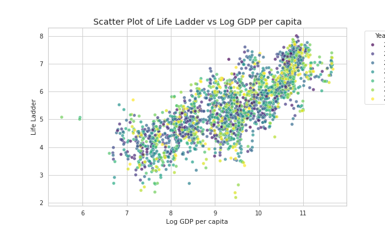

# Data Analysis Report

    ## Narrative Analysis of Global Well-Being Dataset

### Introduction
In an era where understanding the nuances of well-being across nations is paramount, we delve into a comprehensive dataset encompassing 2,363 rows and 11 columns, each representing crucial indicators of quality of life and happiness across various countries and years. By examining both subjective and objective measures—ranging from happiness levels to economic indicators—we aim to uncover patterns, correlations, and anomalies that can inform policymakers, researchers, and social organizations.

### Dataset Overview
The dataset is rich with diverse metrics that provide insights into the well-being of populations worldwide. Each column plays a pivotal role in framing the context of our analysis. 

- **Country Name**: Identifies the geographical context for the data, though variations in naming conventions may necessitate careful handling during analyses.
- **Year**: Offers a temporal framework for the data, essential for identifying trends over time.
- **Life Ladder**: A subjective happiness measure that allows us to gauge perceived quality of life across cultures.
- **Log GDP per Capita**: Serves as a key economic indicator linked to overall well-being.
- **Social Support**: A critical factor in mental health, indicating the strength of community ties.
- **Healthy Life Expectancy**: Reflects health outcomes and their direct impact on well-being.
- **Freedom to Make Life Choices**: This measure underscores the importance of autonomy in fostering happiness.
- **Generosity** and **Perceptions of Corruption**: Highlight the social dynamics and trust levels within societies.
- **Positive and Negative Affect**: Capture emotional well-being, providing a holistic view of happiness.

### Statistical Insights
The statistical analysis reveals intriguing patterns and relationships among the dataset's features. Notably, both the "Year" and "Life Ladder" exhibit significant importance scores, suggesting that these variables are influential in shaping overall well-being perceptions. The absence of normality across features indicates that traditional parametric tests may not be suitable, directing us towards non-parametric methods for more accurate insights. 

Outlier analysis unveils critical anomalies, particularly in "Perceptions of Corruption," where a vast number of outliers indicate stark disparities in how corruption is perceived globally. This variability signals potential regions requiring targeted interventions. Furthermore, clustering identifies two distinct groups within the dataset: one characterized by higher happiness and economic prosperity, and another reflecting lower scores in these domains.

### Unexpected Patterns and Correlations
Notably, our analysis highlights significant correlations among the features, particularly between social support and the Life Ladder. This suggests that stronger social networks may directly contribute to increased life satisfaction. Temporal patterns further enrich our understanding; some countries exhibit marked improvements or declines over time, indicating the influence of socio-economic changes or policy interventions.

### Strategic Recommendations
To optimize the insights gleaned from this dataset, several strategic recommendations emerge:

1. **Data Preprocessing**: Implement thorough data cleaning and standardization to ensure consistency across entries. This includes addressing missing values and standardizing country names.
   
2. **Outlier Management**: Focus on robust outlier detection and treatment methods. Understanding whether outliers represent valid extreme values or anomalies will enhance our analyses.

3. **In-Depth Cluster Analysis**: Investigate the characteristics of identified clusters to tailor policy interventions effectively, particularly in regions exhibiting lower well-being metrics.

4. **Temporal Trends Exploration**: Conduct a longitudinal study to understand how well-being indicators evolve over time, potentially uncovering the impact of significant global events.

5. **Machine Learning Strategies**: Employ advanced techniques such as regression analysis, clustering algorithms, and PCA to gain deeper insights into the data and refine our predictive capabilities.

### Visualization Insights
To visualize the critical relationship between "Log GDP per Capita" and "Life Ladder," a scatter plot has been created using advanced data visualization techniques. This plot, designed to highlight how economic factors relate to perceived happiness levels, employs a color gradient to signify different years, thus adding a temporal dimension to the analysis. By showcasing the interplay between economic prosperity and well-being, this visualization not only aids in understanding current trends but also provides a powerful tool for communicating findings to stakeholders.

### Conclusion
This comprehensive analysis underscores the complexity of well-being metrics across nations, revealing critical insights into the factors influencing happiness and quality of life. By addressing the data’s unique characteristics and challenges, and by leveraging strategic recommendations, stakeholders can harness these findings to formulate effective policies, drive meaningful interventions, and ultimately enhance well-being on a global scale. The journey through this dataset not only illuminates current states but also paves the way for future research and action in the pursuit of happiness and quality of life worldwide.

    

## Visualizations

