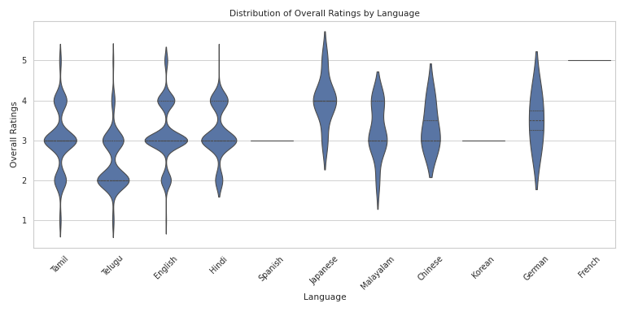

# Data Analysis Report

    ### Comprehensive Dataset Analysis: A Narrative Journey

In the realm of data analysis, understanding the structure and characteristics of a dataset is paramount to extracting meaningful insights. Our exploration begins with a comprehensive overview of the dataset, which comprises **2,652 rows** and **8 columns**. These columns encompass a mix of text and categorical numeric fields, providing a rich tapestry of information ripe for analysis.

#### Exploring the Dataset Structure

The dataset includes essential columns such as **date**, **language**, **type**, **title**, **by**, **overall**, **quality**, and **repeatability**. Each column offers unique insights: the **date** column, despite its text format, is crucial for temporal analysis; **language** can help segment the data across linguistic demographics; while the **overall**, **quality**, and **repeatability** columns offer quantitative measures that facilitate comparative assessments.

However, the dataset also presents potential challenges. Inconsistent formatting in the text fields can lead to aggregation difficulties, while missing values may skew results. Additionally, the presence of outliers—particularly in the numeric fields—raises concerns about the reliability of statistical analyses. Understanding these intricacies sets the stage for a deeper exploration of the data.

#### Statistical Insights and Patterns

As we delve into the statistical landscape, we uncover significant findings regarding outliers and clusters. Our analysis reveals a staggering **45.85%** of the dataset comprises outliers, particularly in the **overall** ratings. This high percentage indicates substantial variability, suggesting either extreme values or potential data quality issues. In contrast, the **quality** feature appears more stable, with only **0.90%** identified as outliers.

Utilizing the **Isolation Forest** method, we detect **261 outliers**, representing **9.84%** of the dataset, which consistently span multiple dimensions—quality and repeatability. This consistency hints at a systematic issue that warrants further investigation.

The clustering analysis suggests that the dataset can be effectively grouped into **10 distinct segments**. This finding opens doors to understanding hidden patterns within the data, potentially illuminating customer behaviors or operational efficiencies that were previously obscured.

#### Strategic Recommendations for Enhanced Analysis

To harness the power of this dataset, we propose several strategic recommendations. First, preprocessing steps such as normalization of numeric fields and proper encoding of categorical variables will enhance the dataset's usability. Addressing outliers through detection methods and potential removal or separate analysis will further refine our insights.

Moreover, deeper investigation into the identified clusters can unveil common themes and patterns, guiding business strategies and content development. Analyzing temporal trends related to the **date** column will allow for the identification of seasonality or shifts in consumer behavior that can inform marketing strategies.

#### Visualization of Insights

To visualize our findings, a violin plot was generated to analyze the distribution of **overall** ratings across different languages. This graphical representation not only provides a clear view of how languages compare in terms of ratings but also highlights areas where certain languages may excel or lag, guiding targeted content strategies or quality improvement initiatives.

#### Conclusion: Actionable Insights for Future Endeavors

The journey through this dataset reveals a wealth of information that can be leveraged for strategic insights. By addressing data quality issues, exploring the characteristics of outliers, and conducting thorough cluster analyses, organizations can better understand their audience and enhance operational efficiencies. The insights drawn from this analysis pave the way for informed decision-making, ultimately leading to improved service delivery and customer satisfaction.

In summary, this holistic narrative not only captures the essence of the dataset but also emphasizes the importance of thoughtful analysis and strategic action. Moving forward, the recommendations laid out will serve as a roadmap for leveraging data-driven insights to foster growth and innovation.

    

## Visualizations

