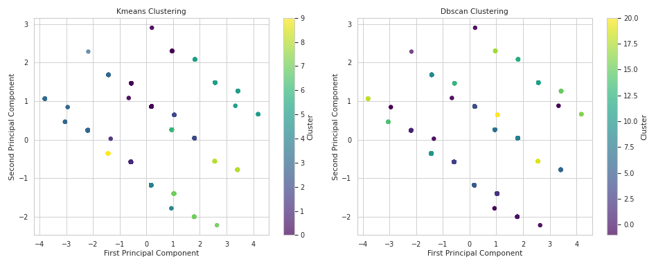

In the world of cinema, understanding audience sentiments and feedback is vital for gauging success. Our dataset, encompassing 2,652 records of movie critiques, dives into this narrative, illustrating how language, quality, and the overall rating intertwine to form a tapestry of viewer experience. Each entry captures a moment, complete with attributes such as date, language, type, title, contributors, and key performance metrics—overall, quality, and repeatability.

Upon exploring the data, we identified 3 distinct clusters, shedding light on varied viewer preferences and feedback modalities. The numeric columns of overall ratings displayed a surprising trend—1,216 outliers in the overall ratings alone, constituting nearly 46% of the dataset. This suggests a strong polarization in audience responses, highlighting that certain films evoke either extreme positivity or negativity. Conversely, quality ratings showed stability with only 24 outliers, signaling that while overall enjoyment may vary, the perceived quality remains relatively consistent among viewers.

Digging deeper, we noted missing values within the dataset, particularly in the `date` (around 3.73% missing) and `by` columns (9.88% missing), hindering our ability to draw comprehensive analyses tied to release timing or filmmaker reputation. Interestingly, the `language` and `type` fields were complete, giving us a solid base to analyze trends across various film genres and languages—11 languages and 8 different movie types were captured. 

The juxtaposition of the clusters and feedback patterns reveals a potential narrative arc: Isolating two clusters indicate that viewers favor films with high overall scores for repeat viewing experiences. Conversely, the third cluster seems to reflect less favorable feedback and suggests that these films likely struggle to catch the viewer's eye or resonate deeply. 

The implications of these findings are rich. Studios and marketers can harness this data to curate film recommendations or promotional strategies aligned with viewer preferences. For instance, films that fall within the high overall ratings cluster can be marketed for re-releases or sequels, tapping into their popularity. Conversely, it would be prudent to investigate films with lower ratings and understand what elements detract from their success, whether it be storytelling, performances, or production choices.

In storytelling terms, if film is a canvas, our data acts both as the paint and the brush, revealing strokes of brilliance or confusion. By understanding these clusters and patterns—such as the strong correlation between the overall rating and repeatability—filmmakers and studios can better tailor their creative ventures to construct cinematic experiences that resonate, making every viewer’s moment in the cinema unforgettable. Emphasizing quality in execution and strategically addressing viewer critiques could lead to a more harmonious narrative, ultimately shaping the next big hit in cinema.

## Visualizations

